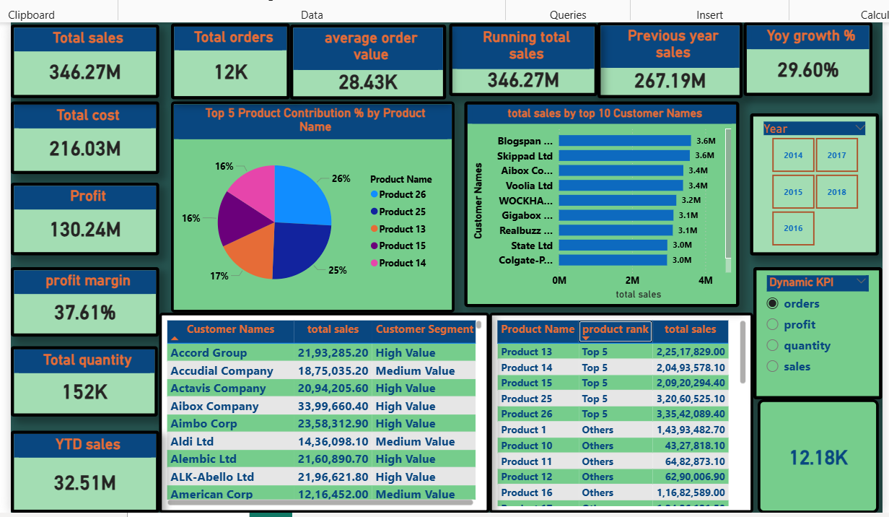

# Sales Performance Dashboard (Power BI)

## Overview

This Power BI dashboard analyzes sales performance using interactive visualizations and KPI cards. It helps track revenue, profit, customer performance, product contribution, and year-over-year business growth.

---

## Business Objective

The objective of this dashboard is to help business stakeholders monitor sales performance, identify top-performing customers and products, and compare current sales with previous year performance.

---

## Tools & Technologies

- Power BI
- Power Query
- DAX
- Data Modeling
- Excel Dataset

---

## Dashboard Features

- Total Sales
- Total Orders
- Average Order Value
- Running Total Sales
- Previous Year Sales
- Year-over-Year Growth %
- Profit & Profit Margin
- Total Quantity
- YTD Sales
- Top 5 Product Contribution
- Top 10 Customers by Sales
- Customer Segmentation
- Product Ranking
- Dynamic KPI Selector
- Year Slicer

---

## Key Business Insights

- Total Sales: **346.27M**
- Total Profit: **130.24M**
- Profit Margin: **37.61%**
- Total Orders: **12K**
- YoY Growth: **29.60%**
- Previous Year Sales: **267.19M**
- Average Order Value: **28.43K**

---

## Dashboard Preview



---

## Files Included

```
dashboard/
    power bi assignment 2.pbix

images/
    dashboard_screenshot.png

README.md
```

---

## Future Improvements

- Add regional sales map
- Add drill-through pages
- Add forecasting visuals
- Connect dashboard with live SQL database
- Publish using Power BI Service

---

## Author

**Suman Shankar**

Aspiring Data Analyst skilled in SQL, Power BI, Excel and Python.
